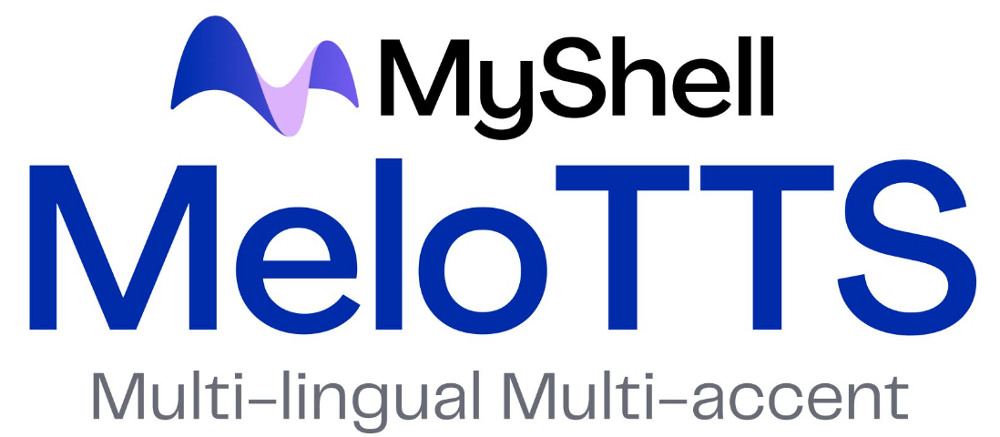

<div align="center">
  <div>&nbsp;</div>
   <br>
  <a href="https://trendshift.io/repositories/8133" target="_blank"></a>
</div>

## Introduction
MeloTTS is a **high-quality multi-lingual** text-to-speech library by [MIT](https://www.mit.edu/) and [MyShell.ai](https://myshell.ai). Supported languages include:

This fork adds **streaming WebSocket TTS**, an **iterator-style API with phoneme-aligned timing**, and **expression/animation tags** for real-time, avatar-friendly applications.

| Language | Example |
| --- | --- |
| English (American)    | [Link](https://myshell-public-repo-host.s3.amazonaws.com/myshellttsbase/examples/en/EN-US/speed_1.0/sent_000.wav) |
| English (British)     | [Link](https://myshell-public-repo-host.s3.amazonaws.com/myshellttsbase/examples/en/EN-BR/speed_1.0/sent_000.wav) |
| English (Indian)      | [Link](https://myshell-public-repo-host.s3.amazonaws.com/myshellttsbase/examples/en/EN_INDIA/speed_1.0/sent_000.wav) |
| English (Australian)  | [Link](https://myshell-public-repo-host.s3.amazonaws.com/myshellttsbase/examples/en/EN-AU/speed_1.0/sent_000.wav) |
| English (Default)     | [Link](https://myshell-public-repo-host.s3.amazonaws.com/myshellttsbase/examples/en/EN-Default/speed_1.0/sent_000.wav) |
| Spanish               | [Link](https://myshell-public-repo-host.s3.amazonaws.com/myshellttsbase/examples/es/ES/speed_1.0/sent_000.wav) |
| French                | [Link](https://myshell-public-repo-host.s3.amazonaws.com/myshellttsbase/examples/fr/FR/speed_1.0/sent_000.wav) |
| Chinese (mix EN)      | [Link](https://myshell-public-repo-host.s3.amazonaws.com/myshellttsbase/examples/zh/ZH/speed_1.0/sent_008.wav) |
| Japanese              | [Link](https://myshell-public-repo-host.s3.amazonaws.com/myshellttsbase/examples/jp/JP/speed_1.0/sent_000.wav) |
| Korean                | [Link](https://myshell-public-repo-host.s3.amazonaws.com/myshellttsbase/examples/kr/KR/speed_1.0/sent_000.wav) |

Some other features include:
- The Chinese speaker supports `mixed Chinese and English`.
- Fast enough for `CPU real-time inference`.

## What's new in this fork

This fork adds features aimed at **real-time apps, avatars, and tools**, on top of upstream MeloTTS:

- **Streaming TTS over WebSockets**
  - Lightweight WebSocket server that streams audio chunks to browser or remote clients.
  - HTML/JS demo clients in `html/` show how to send text and play audio as it streams (no need to wait for the full utterance).

- **Iterator-style TTS API**
  - New `TTS.tts_iter(...)` method in `melo/api.py`:
    - Yields `(audio_segment, phoneme_metadata)` per sentence/segment.
    - Lets you consume audio progressively for streaming and interactive pipelines.

- **Phoneme-level timing for alignment**
  - Each phoneme now includes approximate time information, derived from the model's internal frame durations:
    - `start_ms`, `duration_ms`, `end_ms` – integer milliseconds (backwards-compatible).
    - `start_us`, `duration_us`, `end_us` – integer microseconds for higher-resolution alignment.
  - Useful for lip-sync, animation, and karaoke-style highlighting.

- **Expression and animation tags in text**
  - Text can include special inline tags for expressions, animation cues, or other events.
  - The G2P pipeline tracks where these tags occur and attaches them to phoneme metadata.
  - The iterator output can include a `tags` field on phonemes so you can trigger expressions or other in-engine events in sync with the speech.

## Usage
- [Use without Installation](docs/quick_use.md)
- [Install and Use Locally](docs/install.md)
- [Training on Custom Dataset](docs/training.md)

The Python API and model cards can be found in [this repo](https://github.com/myshell-ai/MeloTTS/blob/main/docs/install.md#python-api) or on [HuggingFace](https://huggingface.co/myshell-ai).

**Contributing**

If you find this work useful, please consider contributing to this repo.

- Many thanks to [@fakerybakery](https://github.com/fakerybakery) for adding the Web UI and CLI part.

## Authors

- [Wenliang Zhao](https://wl-zhao.github.io) at Tsinghua University
- [Xumin Yu](https://yuxumin.github.io) at Tsinghua University
- [Zengyi Qin](https://www.qinzy.tech) (project lead) at MIT and MyShell
- Joel "val" Ward (val@ai.ccl.io) at CircleClickLabs

**Citation**
```
@software{zhao2024melo,
  author={Zhao, Wenliang and Yu, Xumin and Qin, Zengyi},
  title = {MeloTTS: High-quality Multi-lingual Multi-accent Text-to-Speech},
  url = {https://github.com/myshell-ai/MeloTTS},
  year = {2023}
}
```

## License

This library is under MIT License, which means it is free for both commercial and non-commercial use.

## Acknowledgements

This implementation is based on [TTS](https://github.com/coqui-ai/TTS), [VITS](https://github.com/jaywalnut310/vits), [VITS2](https://github.com/daniilrobnikov/vits2) and [Bert-VITS2](https://github.com/fishaudio/Bert-VITS2). We appreciate their awesome work.
