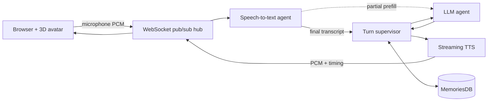

# Agatha

Agatha is an experimental voice-to-voice AI avatar. You talk to her through a
browser, she transcribes the audio, sends the conversation through an LLM, and
speaks the answer while a 3D avatar reacts in real time. Facial expressions,
body animations, lip sync, and other cues can be scheduled alongside the
streaming speech instead of being added after playback.

> **Status: early pre-alpha.** The core conversation loop works, but this is a
> personal research project with rough edges. Expect startup delays, occasional
> voice-recognition failures, unfinished controls, and breaking changes.

## Demo

- **Live demo:** [a.ccl.io/a/](https://a.ccl.io/a/)
- **YouTube walkthrough:** [replace this with the video URL](https://youtu.be/REPLACE_WITH_VIDEO_ID)

The hosted demo may require an account. Chrome or another Chromium-based browser
currently gives the most predictable microphone and audio behavior. On mobile,
allow microphone access and make sure the device is not muted.

## What works today

- Push-to-talk voice conversations in the browser
- Streaming speech-to-text with partial transcript prefill
- Streaming LLM responses through a WebSocket pub/sub system
- Streaming text-to-speech audio with phoneme timing and animation events
- Real-time lip sync, facial expressions, blinking, eye movement, idle motion,
  and animation cues during speech
- VRM/glTF avatars and FBX/keyframe animations
- Persistent conversations backed by PostgreSQL and pgvector
- Ollama and OpenAI-compatible LLM endpoints

## How it fits together

The pieces are deliberately separate processes. The browser handles the avatar,
microphone capture, playback, and interaction state. Backend agents communicate
over named WebSocket channels, while MemoriesDB stores users, conversations,
events, and vector-searchable memories.

## Repository map

| Directory | Purpose |
| --- | --- |
| [`agatha-fe`](agatha-fe/) | Browser UI, 3D avatar, microphone capture, audio playback, and animation |
| [`aif`](aif/) | Supervisor, LLM, voice-recognition, and audio agents |
| [`memoriesdb`](memoriesdb/) | Authentication, conversations, graph/vector memory, and database services |
| [`pubsubhub`](pubsubhub/) | HTTP and WebSocket pub/sub entry point |
| [`MeloYeloTTS`](MeloYeloTTS/) | Avatar-oriented MeloTTS fork for streaming audio, phoneme timing, and synchronized expression/animation cues |
| [`mtd`](mtd/) | Experimental task-management tools |

## Running it locally

Local setup is still developer-oriented rather than turnkey. You currently
need:

- Linux
- Python 3.12 and [`uv`](https://docs.astral.sh/uv/)
- Node.js and npm
- Docker for PostgreSQL/pgvector
- An Ollama or OpenAI-compatible model endpoint
- A Pulse STT API key in `PULSE_API_KEY`
- The MeloYeloTTS model and its Python dependencies

The usual development startup order is:

1. Configure and start PostgreSQL/MemoriesDB from [`memoriesdb`](memoriesdb/).
2. Start streaming TTS from [`MeloYeloTTS`](MeloYeloTTS/).
3. Configure `aif/.env`, then start the AIF processes from [`aif`](aif/).
4. Serve [`agatha-fe/html`](agatha-fe/html/) as the web root, directly or through
   the supplied nginx routing configuration.
5. Open `/a/` over HTTPS or localhost so browser microphone access is available.

Component-specific setup and architecture notes live in each directory. A
single clean installer or Compose stack is still on the roadmap.

Do not commit API keys or passwords. Keep `PULSE_API_KEY`, database credentials,
model credentials, and internal service secrets in local environment files or a
secret manager.

## Known limitations

- Voice recognition depends on an external STT service and can occasionally
  miss or delay the final transcript.
- First-response latency depends heavily on the configured model and hardware.
- Mobile browser behavior has had less testing than desktop Chromium.
- Some debug and animation controls are development UI rather than finished
  product design.
- Local deployment involves several independently started services.
- The authentication, authorization, resource limits, and tool sandboxing are
  not yet hardened for a production multi-user deployment.

Please do not use the pre-alpha demo for sensitive conversations or data.

## Why I built it

Most LLM interfaces still feel like text boxes with speech added afterward. I
wanted to explore what changes when voice, response timing, memory, expressions,
and body movement are treated as parts of one conversation loop.

The project is also an experiment in small cooperating processes: speech
recognition can warm the model from partial transcripts, the supervisor can
coordinate text and audio independently, and animation cues can travel alongside
speech timing. MeloYeloTTS was forked specifically to make that last part
possible: it streams audio segments while exposing phoneme-level timing and
expression/animation events that the avatar can consume during playback.

## Feedback

For this first release, I am especially interested in:

- Whether the voice interaction feels natural enough to keep using
- Where latency is most noticeable
- Whether the avatar adds useful presence or becomes distracting
- Which parts of the architecture are worth simplifying
- What breaks on different browsers, phones, and hardware

Issues and technical discussion are welcome. This is an early public snapshot,
so candid bug reports are useful.

## Acknowledgements

Agatha uses Three.js and the VRM ecosystem for rendering, Ollama or an
OpenAI-compatible endpoint for language models, PostgreSQL/pgvector for memory,
and the MeloYeloTTS fork for streaming speech, phoneme timing, and synchronized
avatar events. See the component directories for their dependencies, upstream
projects, and licenses.
