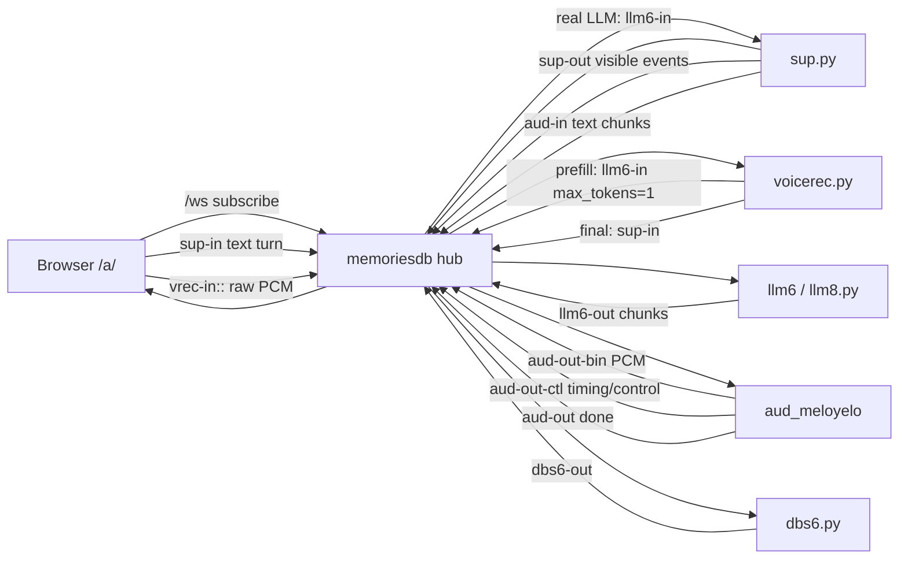
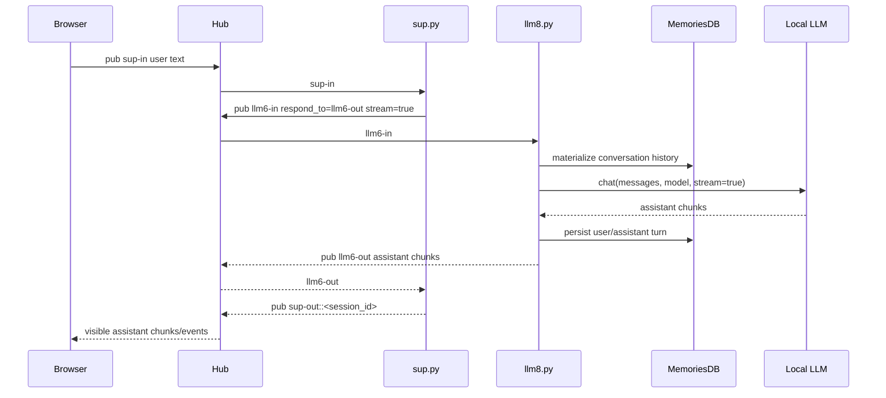
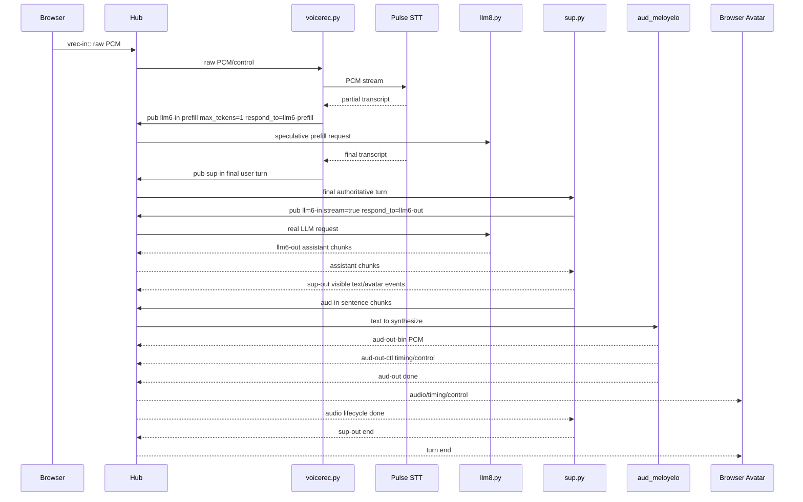
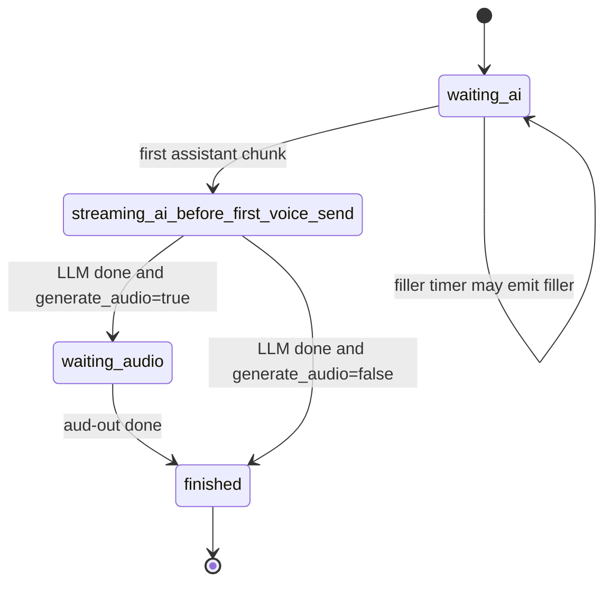
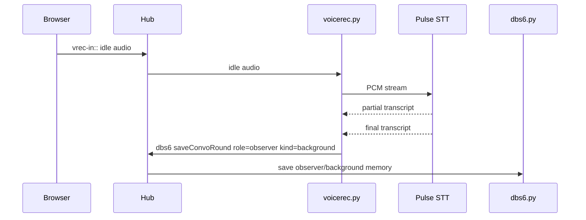

# Agatha Pubsub Internals

This document describes the internal runtime flow once traffic reaches the websocket pubsub hub. Nginx and external ingress are documented separately in [`ingress-routing.md`](./ingress-routing.md).

The short version:

```text
Nginx gets the browser to /ws.
The pubsub hub routes packets by channel.
Agatha behavior emerges from agents exchanging channel-scoped packets.
```

## Process Roles

| Process | Repo | Role |
|---|---|---|
| `hub` | `memoriesdb` | WebSocket pubsub hub, auth/session bootstrap, static/default HTTP routes |
| `dbs6` | `memoriesdb` | Conversation/database command service |
| `llm6` / `llm8.py` | `memoriesdb` | LLM generation agent; loads/persists conversation history and calls the local model endpoint |
| `sup.py` | `aif` | Agatha supervisor; manages turns, filler, LLM routing, visible text, audio routing, and avatar events |
| `voicerec.py` | `aif` | Voice recognition agent; receives browser audio, talks to STT, emits prefill and final turn packets |
| `aud_meloyelo` | `aif` | TTS/audio agent; receives text and emits audio/control/timing outputs |
| `web` | `aif` | Static Agatha frontend/assets server |
| Browser `/a/` | `aif/html/a` | Avatar UI, mic input, audio playback, lip sync, debug feed |

## Core Concepts

### Pubsub Hub

The hub is a websocket message bus. Clients subscribe to output channels through query params:

```text
/ws?c=sup-out&c=aud-out-bin&c=aud-out-ctl
```

Agents publish packets to input channels such as:

```text
sup-in
llm6-in
aud-in
vrec-in::
dbs6-in
```

### Generic JSON Packet

Most application packets use this shape:

```json
{
  "method": "pub",
  "params": {
    "channel": "sup-in",
    "role": "user",
    "content": "hello",
    "uuid": "<user_id>",
    "session_id": "<session_id>",
    "conversation": "<conversation_id>",
    "turn_id": "<turn_id>",
    "stream": true
  }
}
```

### Raw/Binary Packet

Some channels carry raw payloads, especially microphone/audio data. The browser or agent first sends the channel name, then sends binary or raw content.

```text
frame 1: vrec-in::<session_id-or-routing-suffix>
frame 2: <binary PCM payload>
```

### Session-Scoped Output Channels

Many service responses use session-scoped output channels:

```text
sup-out::<session_id>
llm6-out::<session_id>
dbs6-out::<session_id>
aud-out::<session_id>
```

The hub can strip or route by the `::<session_id>` suffix so the right browser session receives the right messages.

### `turn_id`

`turn_id` groups everything that belongs to one conversational turn:

- voice partial prefill packets
- final transcript packet
- LLM chunks
- supervisor state
- audio text chunks
- binary audio/control outputs
- avatar updates

For voice, the same `turn_id` is used for speculative prefill and the final authoritative turn.

### `conversation`

`conversation` points to the MemoriesDB conversation/history context. The LLM agent uses it to materialize prior messages and persist new records.

### `respond_to`

`respond_to` tells an agent where to publish the reply.

Examples:

```text
respond_to = llm6-out       # real LLM turn routed back to sup.py
respond_to = llm6-prefill   # speculative prefill response, normally not user-visible
```

### `done`

`done=true` means the sender considers that stream/lifecycle complete. Its exact meaning depends on channel:

| Channel | Meaning of `done=true` |
|---|---|
| `llm6-out` | LLM response stream completed |
| `aud-in` | No more text for this audio turn |
| `aud-out` | Audio generation/playback lifecycle completed |
| `sup-out` | Supervisor turn lifecycle completed |

## Channel Map

| Channel | Producer | Consumer | Purpose |
|---|---|---|---|
| `sup-in` | browser, `voicerec.py` | `sup.py` | Real user turns into Agatha supervisor |
| `sup-out::<session_id>` | `sup.py` | browser | Visible assistant text, avatar events, turn lifecycle |
| `llm6-in` | `sup.py`, `voicerec.py` | `memoriesdb.services.llm8` | LLM requests and speculative prefill requests |
| `llm6-out` / `llm6-out::<session_id>` | `llm8.py` | `sup.py`, browser chat clients | LLM streamed chunks |
| `llm6-prefill` | `llm8.py` | diagnostic/prefill consumer | Speculative prefill output; normally not user-visible |
| `vrec-in::` | browser | `voicerec.py` | Raw mic PCM/control packets |
| `aud-in` | `sup.py` | `aud_meloyelo` | Text chunks to synthesize |
| `aud-out` / `aud-out::<session_id>` | `aud_meloyelo` | `sup.py` | Audio lifecycle/control completion |
| `aud-out-bin` | `aud_meloyelo` | browser | Binary PCM/audio output |
| `aud-out-ctl` | `aud_meloyelo` | browser | Audio control/timing metadata |
| `img-out` | image/vision agents | `sup.py` | Image/avatar auxiliary messages |
| `dbs6-in` | clients/agents | `dbs6.py` | DB/conversation commands |
| `dbs6-out::<session_id>` | `dbs6.py` | clients/agents | DB command responses |

## High-Level Runtime Diagram



## Text Turn Flow

Text input from the browser is already authoritative. It goes directly to the supervisor.



## Voice Turn Flow With Prefill

Voice has two paths:

1. speculative prefill from partial STT text
2. final authoritative user turn after STT finalization



## Real Turn vs Prefill

### Prefill

A prefill packet is speculative. It is sent from `voicerec.py` as partial STT results arrive.

```json
{
  "channel": "llm6-in",
  "role": "user",
  "content": "<partial or current best transcript>",
  "uuid": "<user_id>",
  "session_id": "<session_id>",
  "conversation": "<conversation_id>",
  "turn_id": "<same_turn_id_as_final>",
  "prefill": true,
  "stream": false,
  "sequence_no": 12,
  "respond_to": "llm6-prefill",
  "max_tokens": 1
}
```

Rules:

- speculative only
- not user-visible
- should not persist as normal history
- uses `max_tokens=1`
- uses the same `turn_id` as the final turn
- normally responds to `llm6-prefill`

### Real Authoritative Turn

A real voice turn is sent after STT finalization.

```json
{
  "channel": "sup-in",
  "role": "user",
  "content": "<final transcript>",
  "uuid": "<user_id>",
  "session_id": "<session_id>",
  "conversation": "<conversation_id>",
  "turn_id": "<turn_id>",
  "generate_audio": true,
  "stream": false,
  "sequence_no": 12,
  "started_at": 1710000000.0,
  "ended_at": 1710000002.4
}
```

Rules:

- authoritative user turn
- handled by `sup.py`
- forwarded to `llm6-in`
- streams LLM output
- may generate audio
- persists through MemoriesDB/LLM history path

## Supervisor Turn State

`sup.py` owns the high-level turn lifecycle.



Important behaviors:

- filler speech can be emitted if voice is enabled and the LLM is slow
- first assistant chunk cancels filler timers
- visible assistant chunks are forwarded to `sup-out`
- voice text is chunked and sent to `aud-in`
- the turn does not finish until audio completion when audio is enabled

## LLM Routing

`sup.py` does not call the model directly. It forwards real turns to the LLM channel:

```text
sup.py -> llm6-in -> memoriesdb.services.llm8 -> local model endpoint
```

The LLM agent:

1. loads/materializes conversation history
2. appends the current user turn
3. calls `memoriesdb.lib.ai.chat()`
4. streams assistant chunks
5. persists the final assistant record
6. publishes chunks to `llm6-out` or the requested `respond_to` channel

The actual model endpoint depends on environment:

```text
LLM_PROTOCOL=ollama              -> local Ollama client
LLM_PROTOCOL=openai              -> OPENAI_BASE_URL/chat/completions
LLM_PROTOCOL=openai_compatible   -> OPENAI_BASE_URL/chat/completions
```

Locality rule:

```text
localhost means local to the process running llm8.py.
```

Run `llm8.py` on the same machine as the GPU-backed model server unless the model endpoint is explicitly tunneled.

## Background / Idle Speech

Idle/background speech is not a normal user turn. It can be saved as observer context.



Observer/background messages can later be included in LLM context, but they are not the same as explicit user turns.

## Failure Modes and Debugging

### Browser connects but no response

Check:

- `/ws` reaches hub
- browser subscribed to `sup-out`, `aud-out-bin`, `aud-out-ctl`
- `sup.py` is running and subscribed to `sup-in`
- `llm8.py` is running as `llm6`
- messages include `turn_id`
- `sup.py` has a turn queue for that `turn_id`

### Voice records but no answer

Check:

- raw PCM reaches `vrec-in::`
- STT returns partial/final transcripts
- prefill packets go to `llm6-in` with `max_tokens=1`
- final transcript is published to `sup-in`
- `sup.py` forwards final turn to `llm6-in`

### Text appears but no voice

Check:

- input packet has `generate_audio=true`
- `sup.py` sends sentence chunks to `aud-in`
- `aud_meloyelo` is running
- browser receives `aud-out-bin`
- browser audio was armed/unmuted

### Audio plays but timing/lip sync is wrong

Check:

- `aud-out-ctl` timing/control packets
- units: milliseconds vs seconds
- browser scheduling offset
- PCM chunk queue behavior
- whether timing refers to generated audio start or wall-clock receipt time

## Related Docs

- [`ingress-routing.md`](./ingress-routing.md) — nginx/autossh/path-to-port routing
- [`voice-recognition-and-prefill.md`](./voice-recognition-and-prefill.md) — detailed STT partial/final/prefill behavior
- [`audio-output-and-timing.md`](./audio-output-and-timing.md) — TTS, word/syllable timing, PCM, lip sync
