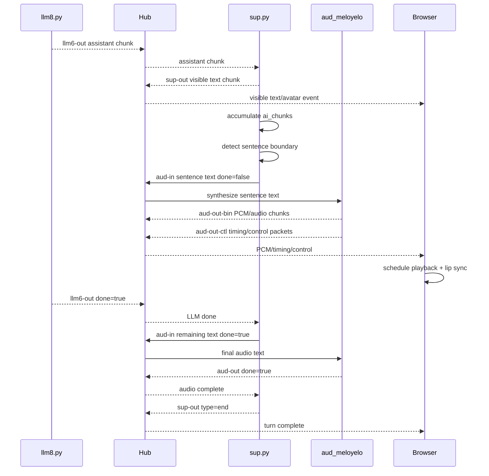
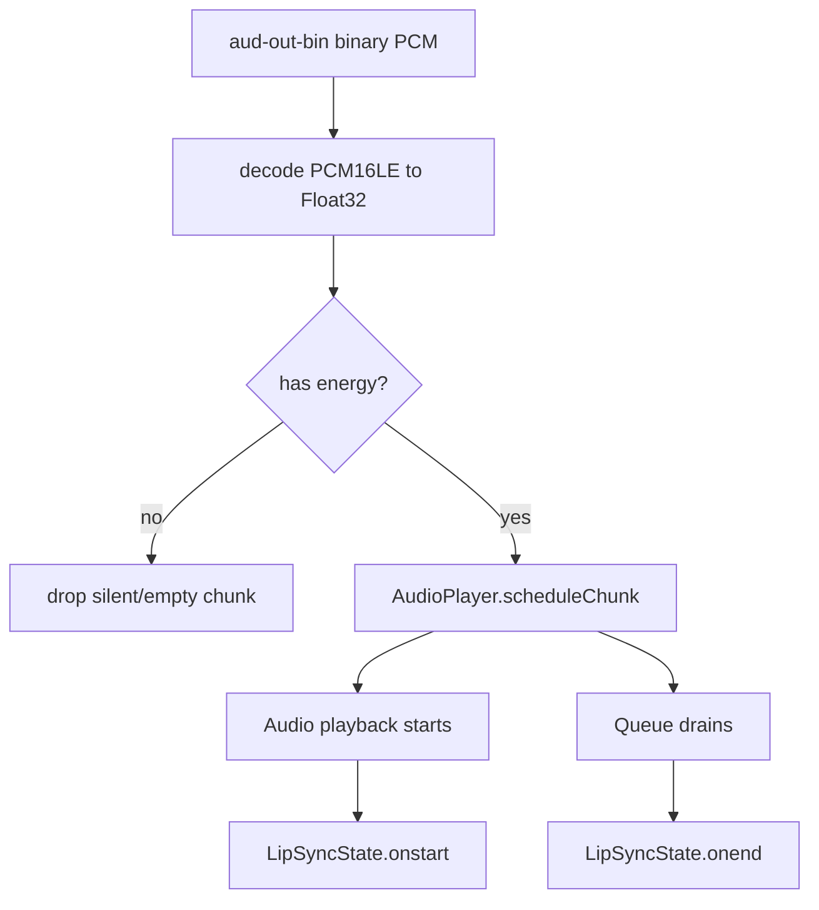
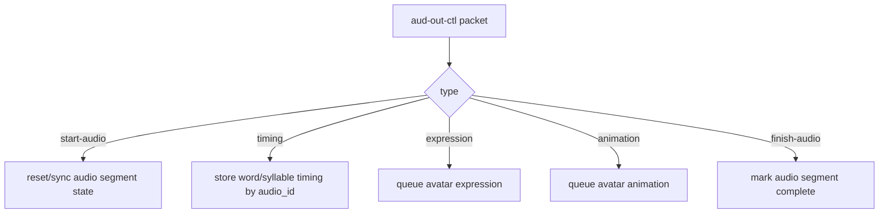
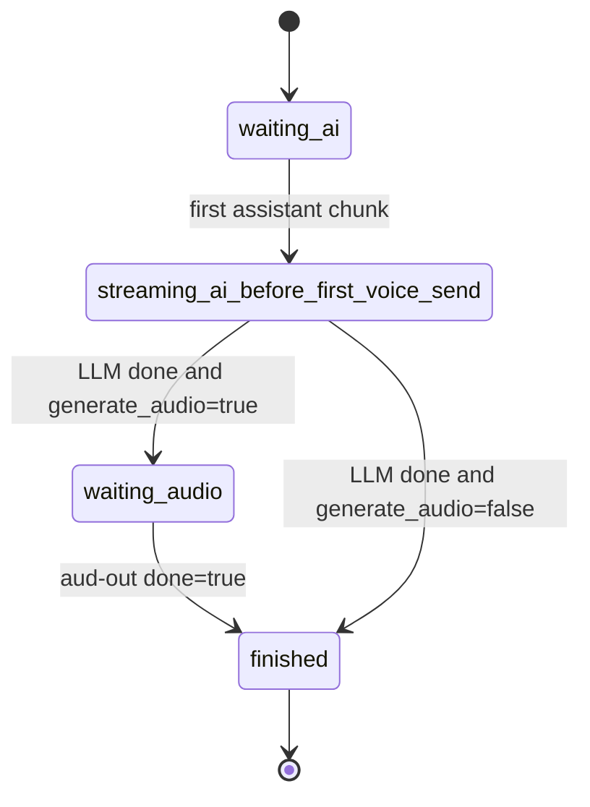

# Audio Output and Timing

This document describes how assistant text becomes voice output, how audio packets return to the browser, and where timing/lip-sync metadata belongs.

For the broader runtime channel map, see [`agatha-pubsub-internals.md`](./agatha-pubsub-internals.md).

## Purpose

Audio output is not just “call TTS and play a file.” In Agatha, audio is part of the turn state machine:

```text
LLM text chunks
  -> supervisor sentence chunking
  -> aud-in
  -> TTS/audio agent
  -> aud-out-bin binary audio
  -> aud-out-ctl timing/control
  -> browser AudioPlayer + lip sync/avatar timing
```

The subtle part is aligning streamed text, generated audio, and avatar motion.

## Actors

| Actor | Role |
|---|---|
| `llm8.py` | Streams assistant text chunks on `llm6-out` |
| `sup.py` | Forwards visible text, chunks sentences for speech, tracks turn/audio lifecycle |
| `aud_meloyelo` | TTS/audio service; produces PCM/audio/control/timing outputs |
| Browser `/a/` | Plays PCM/audio, drives lip sync, applies control/timing events |
| `AudioPlayer` | Browser-side PCM scheduler/playback component |
| `LipSyncState` | Browser-side lip-sync lifecycle state |

## Audio-Enabled Turn Overview



## Supervisor Responsibilities

`sup.py` does three things with assistant text:

1. forwards text to the browser for display/avatar events
2. buffers chunks into sentence-ish text segments
3. sends speech segments to `aud-in`

The supervisor only routes text to TTS when `generate_audio=true` on the original user turn.

## Sentence Chunking

The supervisor receives streamed assistant chunks and accumulates them in `ai_chunks`.

When voice is enabled, it scans the accumulated text for sentence boundaries:

```text
.
!
?
```

A boundary is accepted when followed by a space or end of accumulated text.

When a boundary is found:

```text
to_send = completed sentence text
remaining = text after sentence boundary
send to_send to aud-in with done=false
keep remaining in ai_chunks
```

This allows speech to begin before the entire LLM response is done.

## Packet: Text to Audio Agent

A typical `aud-in` packet should carry the sentence/segment text and turn context:

```json
{
  "channel": "aud-in",
  "content": "Here is the first sentence.",
  "done": false,
  "uuid": "<user_id>",
  "session_id": "<session_id>",
  "conversation": "<conversation_id>",
  "turn_id": "<turn_id>"
}
```

When the LLM finishes, `sup.py` sends any remaining buffered text with `done=true`:

```json
{
  "channel": "aud-in",
  "content": "Final fragment without punctuation",
  "done": true,
  "uuid": "<user_id>",
  "session_id": "<session_id>",
  "conversation": "<conversation_id>",
  "turn_id": "<turn_id>"
}
```

## Audio Output Channels

| Channel | Payload type | Consumer | Purpose |
|---|---|---|---|
| `aud-out` / `aud-out::<session_id>` | JSON | `sup.py` | Audio lifecycle status and completion |
| `aud-out-bin` | binary | browser | PCM/audio chunks |
| `aud-out-ctl` | JSON | browser | Audio control, timing, lifecycle metadata |

## Expected Timing Metadata

Timing/control packets should be explicit about units and reference points.

Recommended shape:

```json
{
  "channel": "aud-out-ctl",
  "type": "timing",
  "turn_id": "<turn_id>",
  "audio_id": "<audio_segment_id>",
  "unit": "ms",
  "origin": "audio_start",
  "items": [
    {
      "kind": "word",
      "text": "Here",
      "start_ms": 0,
      "end_ms": 160
    },
    {
      "kind": "word",
      "text": "is",
      "start_ms": 170,
      "end_ms": 230
    }
  ]
}
```

Recommended fields:

| Field | Meaning |
|---|---|
| `turn_id` | Conversational turn being spoken |
| `audio_id` | Specific audio segment/chunk group |
| `unit` | Timing unit, preferably `ms` |
| `origin` | What zero means: `audio_start`, `segment_start`, or `wall_clock` |
| `items` | Word/syllable/phoneme timing records |

Do not leave timing origin implicit. That is how lip sync turns into interpretive dance.

## Timing Reference Rules

Prefer this rule:

```text
All word/syllable timings are relative to the start of the audio segment that contains them.
```

Then the browser can translate timing into wall-clock playback time when the segment is actually scheduled.

Avoid this unless needed:

```text
Timing based on when the server generated the audio.
Timing based on when the browser received the packet.
```

Those are fragile because network and queue delays move around.

## Browser Playback Responsibilities

The browser should:

1. receive `aud-out-bin` binary audio chunks
2. decode/schedule PCM chunks
3. mark audio start when playback actually begins
4. apply `aud-out-ctl` timing relative to scheduled audio start
5. drive `LipSyncState` and avatar mouth/bone/expression updates
6. handle cancellation/interrupts by turn/audio ID

## PCM Playback Flow



## Control Packet Flow



## Supervisor Audio State

`sup.py` waits for audio completion when voice is enabled.



This means an LLM response is not the end of a voice turn. The turn finishes only after audio completes.

## Interrupts and Cancellation

When barge-in or cancellation happens, the system should consistently identify what is being canceled.

Recommended cancellation fields:

```json
{
  "type": "cancel",
  "turn_id": "<turn_id>",
  "audio_id": "<audio_segment_id>",
  "reason": "barge_in"
}
```

Cancellation should clear or ignore:

- pending PCM chunks for the canceled turn/audio ID
- queued timing events
- queued avatar expressions/animations that belong to the canceled turn
- supervisor queues waiting for audio completion

## Word vs Syllable vs Phoneme Timing

Use the most precise timing available, but keep the schema explicit.

Recommended item shape:

```json
{
  "kind": "syllable",
  "text": "A-ga",
  "start_ms": 120,
  "end_ms": 260,
  "word_index": 3
}
```

Allowed `kind` values:

```text
word
syllable
phoneme
viseme
marker
```

For lip sync, the browser may eventually prefer phoneme/viseme timing. For transcript highlighting, word timing is enough.

## Failure Modes

### Text appears but no audio

Check:

- original user turn has `generate_audio=true`
- `sup.py` receives assistant chunks on `llm6-out`
- `sup.py` detects sentence boundary or LLM done
- `sup.py` publishes to `aud-in`
- `aud_meloyelo` is running and subscribed
- browser is subscribed to `aud-out-bin` and `aud-out-ctl`
- browser audio has been armed/unmuted

### Audio starts late

Check:

- sentence chunking waits too long for punctuation
- TTS startup latency
- audio queue buffering
- browser autoplay/AudioContext state
- network delay if not local

### Lip sync is early/late

Check:

- timing units are explicit
- timing origin is explicit
- browser uses actual scheduled audio start, not packet receipt time
- PCM queue delay is accounted for
- control packets arrive before or with corresponding audio segment

### Audio continues after barge-in

Check:

- cancellation packet includes `turn_id`/`audio_id`
- browser drops queued chunks for canceled turn
- audio agent stops emitting canceled segment chunks
- supervisor ignores late `aud-out` messages for canceled turn

## Design Rules

1. Visible text and spoken text are related but not identical streams.
2. Audio timing must be relative to playback, not server generation time.
3. Every timing/control packet should include `turn_id`.
4. Every multi-segment audio response should include an `audio_id` or segment ID.
5. The supervisor owns turn completion; the browser owns playback timing.
6. Do not let canceled audio keep driving avatar state.
