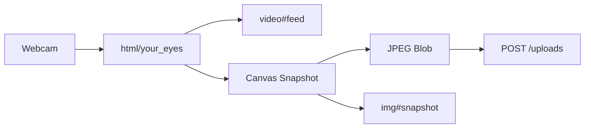
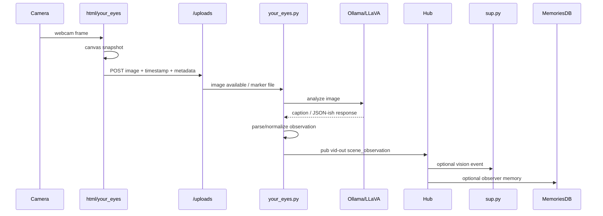
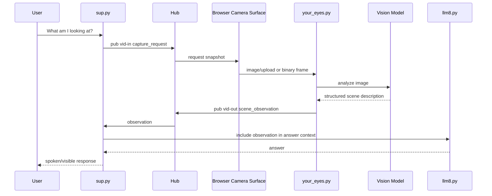

# Vision and Your Eyes

This document describes the current and future vision architecture for Agatha.

Unlike voice, which is already integrated into the pubsub ecosystem, vision is currently a partially implemented subsystem. It has a working browser camera capture path and an experimental LLaVA-based image watcher, but the results are not yet wired back into the pubsub/runtime system.

Related docs:

- [`ingress-routing.md`](./ingress-routing.md) — nginx/autossh/path-to-port routing
- [`agatha-pubsub-internals.md`](./agatha-pubsub-internals.md) — main runtime/channel map
- [`voice-recognition-and-prefill.md`](./voice-recognition-and-prefill.md) — voice partial/final/prefill flow
- [`audio-output-and-timing.md`](./audio-output-and-timing.md) — TTS, audio output, timing, lip sync

## Current Components

| Component | Path | Role |
|---|---|---|
| Browser camera app | `html/your_eyes/index.html` | Mini web app that opens webcam and displays video feed |
| Camera JS | `html/your_eyes/your_eyes.js` | Captures snapshots and uploads JPEGs |
| Styles | `html/your_eyes/styles.css` | Simple webcam/snapshot layout |
| Vision watcher | `src/aif/agents/your_eyes.py` | Experimental agent that watches uploaded images and runs LLaVA through Ollama |
| Upload route | `/uploads` | Receives image snapshots from browser |
| Vision model | `ollama run llava` | Experimental local image analysis |

## Current Browser Camera Flow

The browser app is intentionally simple. It does four things:

1. requests webcam permission
2. displays the webcam feed
3. captures snapshots using a canvas
4. uploads JPEG blobs to `/uploads`

The core browser API is:

```javascript
navigator.mediaDevices.getUserMedia({ video: true })
```

The default snapshot interval is currently 15 seconds.



## Current Upload Payload

The browser currently sends multipart form data:

```text
timestamp
image
```

Example conceptual payload:

```text
POST /uploads
Content-Type: multipart/form-data

field: timestamp = 20260529183000000
field: image = image_20260529183000000.jpg
```

The upload packet currently does **not** include:

- `uuid`
- `session_id`
- `conversation`
- `turn_id`
- camera ID
- mode
- reason for capture

That is fine for the proof-of-life version, but future integration should attach enough metadata to correlate images with sessions, conversations, and vision observations.

## Current Vision Watcher Flow

The experimental Python agent exists at:

```text
src/aif/agents/your_eyes.py
```

It currently:

1. connects to the pubsub hub using `vid-in`
2. defines `vid-out`
3. watches `VIDEO_DIR` for new `.DUN` files
4. strips `.DUN` to find the corresponding uploaded image
5. runs `ollama run llava` against the image
6. prints results to stdout

Current prompt intent:

```text
what is this?
does the person look like they want to talk?
how many people are in the shot?
```

This is important: the prompt is not just generic captioning. It is asking agent-centric questions about presence, engagement, and whether Agatha should pay attention.


## Current Limitations

The current vision pipeline works as a proof of life, but stops before becoming operational.

Current limitations:

- LLaVA output is printed to stdout only.
- No structured JSON result is parsed.
- No `vid-out` observation is published.
- No memory record is saved.
- No supervisor event is emitted.
- No user/session/conversation metadata is attached to uploaded images.
- `/uploads` receives images, but the vision meaning is not yet tied back to Agatha.
- `your_eyes.py` has `vid-in`/`vid-out` names, but the channel contract is not yet defined.

This means the current flow is:

```text
webcam -> JPEG upload -> LLaVA -> stdout
```

The intended future flow should be:

```text
webcam -> JPEG upload -> LLaVA -> structured observation -> pubsub/memory/supervisor
```

## Design Principle

Vision observations are not automatically conversation turns.

A spoken user command is a turn:

```text
User: What time is it?
```

A visual observation is context:

```text
A person is present and looking toward the camera.
```

Those should be treated differently.

Vision should primarily produce observations and events. The supervisor should decide whether to ignore, store, surface, or act on them.

## Future Channels

Vision should become a first-class pubsub subsystem with explicit channels:

```text
vid-in
vid-out
```

Possible roles:

| Channel | Producer | Consumer | Purpose |
|---|---|---|---|
| `vid-in` | browser, supervisor, other agents | `your_eyes.py` / vision agent | Image analysis requests, camera commands, snapshot triggers |
| `vid-out` | `your_eyes.py` / vision agent | `sup.py`, MemoriesDB, debug clients | Structured scene observations and vision events |

This makes vision a peer to the existing subsystems:

```text
sup-in / sup-out
llm6-in / llm6-out
aud-in / aud-out
vrec-in::
vid-in / vid-out
```

## Future Structured Observation Packet

Instead of printing LLaVA output, the vision agent should publish structured observations.

Example:

```json
{
  "channel": "vid-out",
  "type": "scene_observation",
  "uuid": "<user_id>",
  "session_id": "<session_id>",
  "conversation": "<conversation_id>",
  "image_id": "image_20260529183000000.jpg",
  "timestamp": "2026-05-29T18:30:00Z",
  "description": "Person seated at desk looking toward camera.",
  "people_count": 1,
  "engagement": {
    "looking_at_camera": true,
    "wants_to_talk": "maybe",
    "confidence": 0.72
  },
  "objects": ["desk", "monitor", "chair"],
  "raw_model": {
    "model": "llava",
    "prompt_version": "engagement-v1"
  }
}
```

## Future Vision Event Packet

Some observations may be elevated into events.

Example:

```json
{
  "channel": "vid-out",
  "type": "vision_event",
  "event": "person_present",
  "uuid": "<user_id>",
  "session_id": "<session_id>",
  "conversation": "<conversation_id>",
  "timestamp": "2026-05-29T18:30:00Z",
  "confidence": 0.83,
  "summary": "One person is visible and appears to be facing the camera."
}
```

Candidate future events:

```text
person_present
person_entered
person_left
multiple_people_present
looking_at_camera
not_looking_at_camera
wants_to_talk
hand_raised
thumbs_up
whiteboard_visible
screen_visible
unknown_object_visible
```

## Future Observation Flow



## Future On-Demand Vision Query

Agatha should eventually be able to ask for a snapshot when the user asks a visual question.

Examples:

```text
What am I looking at?
Read this whiteboard.
How many people are here?
What is on my desk?
Does this look plugged in?
```

Possible future flow:



## Future Capture Request Packet

Example `vid-in` command:

```json
{
  "channel": "vid-in",
  "type": "capture_request",
  "uuid": "<user_id>",
  "session_id": "<session_id>",
  "conversation": "<conversation_id>",
  "turn_id": "<turn_id>",
  "reason": "user_visual_query",
  "prompt": "What am I looking at?",
  "respond_to": "vid-out"
}
```

## Future Memory Integration

Vision observations should be stored as observer/background memories when useful.

Example observer memory:

```json
{
  "role": "observer",
  "kind": "vision",
  "content": "One person is seated at the desk and appears to be looking toward the camera.",
  "metadata": {
    "source": "your_eyes",
    "image_id": "image_20260529183000000.jpg",
    "people_count": 1,
    "wants_to_talk": "maybe",
    "confidence": 0.72
  }
}
```

This mirrors the existing idea of idle/background speech becoming observer context rather than explicit user turns.

## Near-Term Implementation Plan

A reasonable Codex-sized implementation path:

1. Replace hardcoded `http://localhost:5002` in `your_eyes.js` with a relative `/uploads` or `location.origin + '/uploads'` path.
2. Add optional metadata fields to image uploads: `session_id`, `conversation`, `uuid`, `source`, `mode`.
3. Define `vid-out` packet shapes in code.
4. Change `your_eyes.py` so LLaVA output is captured instead of only printed.
5. Ask LLaVA for strict JSON.
6. Parse/normalize the JSON with a fallback for malformed output.
7. Publish a `scene_observation` packet on `vid-out`.
8. Optionally store the observation as an observer memory.
9. Add `your_eyes.py` back to the AIF Procfile when stable.
10. Add a small debug UI or debug feed line for latest vision observation.

## LLaVA Prompt Direction

The current prompt asks the right kind of questions, but future prompts should demand structured JSON.

Example future prompt:

```text
Respond only in JSON.
Analyze this webcam snapshot for an AI assistant.
Return:
- description: short scene description
- people_count: integer
- looking_at_camera: boolean or null
- wants_to_talk: yes/no/maybe
- engagement_confidence: number from 0 to 1
- notable_objects: list of strings
- safety_or_privacy_note: string or null
```

Expected model output:

```json
{
  "description": "A person is seated at a desk facing a computer.",
  "people_count": 1,
  "looking_at_camera": true,
  "wants_to_talk": "maybe",
  "engagement_confidence": 0.68,
  "notable_objects": ["desk", "monitor", "chair"],
  "safety_or_privacy_note": null
}
```

## Long-Term Direction

Vision should evolve in stages:

```text
V0: webcam -> upload
V1: webcam -> upload -> LLaVA stdout
V2: webcam -> upload -> LLaVA -> structured vid-out observation
V3: vid-out observations -> supervisor decisions
V4: useful observations -> MemoriesDB observer memories
V5: user visual queries -> capture request -> vision context -> spoken answer
V6: multi-person/meeting visual events -> Elise/Agatha meeting coordination
```

The existing implementation already proves the most important thing:

```text
A browser can act as a persistent visual sensor for Agatha.
```

The next step is not to make the camera path fancy. The next step is to connect the working camera path to structured observations and pubsub.
