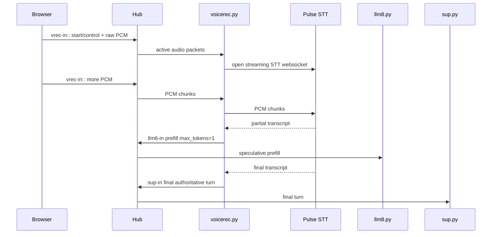
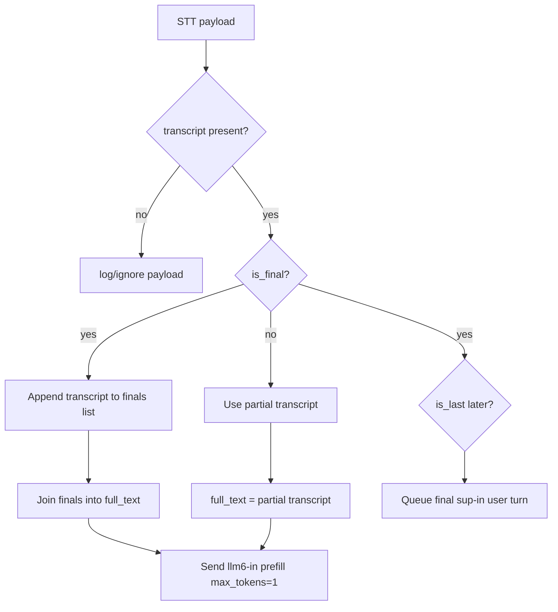
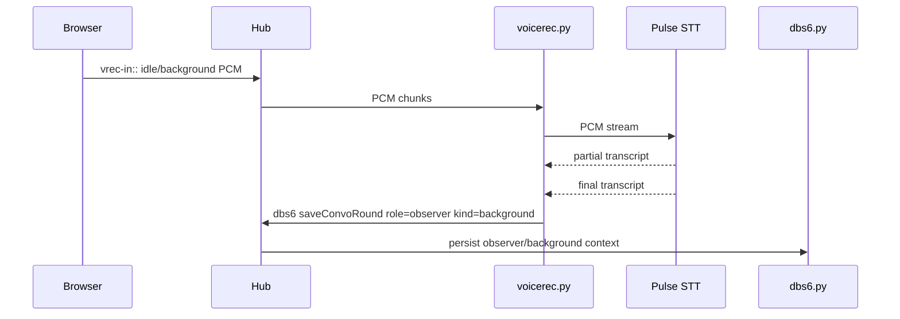

# Voice Recognition and Prefill

This document describes how Agatha turns microphone audio into final user turns, and how partial speech recognition results are used to prefill the LLM path before the final transcript is ready.

For the broader channel map and turn lifecycle, see [`agatha-pubsub-internals.md`](./agatha-pubsub-internals.md).

## Purpose

Voice interaction has a latency problem: if the system waits for final STT before touching the LLM, the user feels the delay.

Agatha reduces perceived latency by treating partial STT transcripts as speculative LLM warmup requests.

```text
partial transcript -> llm6-in max_tokens=1 -> prefill/warmup
final transcript   -> sup-in             -> real turn
```

The partial path is speculative. The final path is authoritative.

## Actors

| Actor | Role |
|---|---|
| Browser | Captures microphone audio and sends raw PCM/control packets |
| `voicerec.py` | Owns STT sessions, partial/final transcript handling, prefill, final turn emission |
| Pulse STT | External streaming speech-to-text provider |
| `llm8.py` | Receives speculative prefill packets and real LLM requests through `llm6-in` |
| `sup.py` | Receives final user turns on `sup-in` and coordinates response/audio/avatar flow |

## Recognition Modes

`voicerec.py` maintains multiple recognition paths:

| Mode | Purpose |
|---|---|
| active turn | Explicit user turn, usually push-to-talk or active capture |
| idle/background | Passive speech that can be stored as observer/background context |
| continuous | Conversational mode where utterances can be flushed after a delay |

This doc focuses on active turns and prefill.

## Active Turn Lifecycle



## Packet: Active Final User Turn

After STT finalization, `voicerec.py` publishes the real user turn to `sup-in`.

```json
{
  "channel": "sup-in",
  "role": "user",
  "content": "what are we doing today",
  "uuid": "<user_id>",
  "session_id": "<session_id>",
  "conversation": "<conversation_id>",
  "turn_id": "<turn_id>",
  "generate_audio": true,
  "stream": false,
  "sequence_no": 12,
  "started_at": 1710000000.0,
  "ended_at": 1710000002.4
}
```

Notes:

- `turn_id` identifies the whole conversational turn.
- `sequence_no` preserves ordering across active turns.
- `generate_audio=true` asks `sup.py` to route assistant text to TTS.
- This packet is authoritative and should result in normal LLM generation and persistence.

## Packet: Speculative Prefill

While STT is still producing partials, `voicerec.py` sends speculative packets directly to `llm6-in`.

```json
{
  "channel": "llm6-in",
  "role": "user",
  "content": "what are we doing",
  "uuid": "<user_id>",
  "session_id": "<session_id>",
  "conversation": "<conversation_id>",
  "turn_id": "<same_turn_id_as_final>",
  "prefill": true,
  "stream": false,
  "sequence_no": 12,
  "respond_to": "llm6-prefill",
  "max_tokens": 1
}
```

Rules:

- Prefill is speculative.
- Prefill should not be user-visible.
- Prefill should not be persisted as a normal user turn.
- Prefill uses the same `turn_id` as the final authoritative turn.
- Prefill uses `max_tokens=1` to force minimal generation.
- Prefill output goes to `llm6-prefill`, not the normal visible assistant path.

## Why `max_tokens=1`?

In MemoriesDB, `chat_round()` treats `max_tokens == 1` as prefill behavior.

The intent is:

```text
Materialize context early.
Append the current best user text temporarily.
Touch the model path early.
Avoid saving speculative text as history.
Discard or ignore the tiny generated response.
```

This can reduce latency even without perfect KV-cache reuse, because it warms the request path and gives the model backend a head start. If the model backend supports useful prefix/session reuse, the win can be larger.

## Partial vs Final Transcript Handling



## Ordering

`sequence_no` and `pending_packets` are used so final active packets are published in order.

```text
turn_seq increments for each active turn
pending_packets holds completed turns by sequence_no
next_seq controls ordered publishing
```

This prevents later STT turns from jumping ahead of earlier ones if finalization happens out of order.

## Background / Idle Recognition

Idle recognition is different from active turns. Final idle transcripts can be saved as observer/background context rather than sent as user turns.



Observer/background speech is not the same as an explicit user command. It may later be injected as context, depending on LLM history materialization settings.

## Continuous Mode

Continuous mode buffers final transcript pieces and flushes them after a delay.

Conceptually:

```text
continuous STT finals
  -> cont_buffer
  -> delayed flush
  -> emit_user_turn(text)
  -> sup-in
```

This lets natural speech settle before creating an explicit user turn.

## Failure Modes

### Partial prefill happens but final turn does not

Check:

- STT sends `is_last`
- active turn receives stop/close control
- final transcripts are present in `finals`
- `queue_active_packet()` receives non-empty text
- `pending_packets` ordering is not blocking on an earlier missing sequence

### Final turn happens but latency is still bad

Check:

- prefill packets are actually sent while the user is still speaking
- `llm8.py` is running on the same box as the model server
- model backend supports useful warmup/prefix behavior
- prompt/history materialization is not the true bottleneck
- network round trip to STT is not dominating

### Speculative text gets persisted

Check:

- prefill uses `max_tokens=1`
- LLM agent still treats `max_tokens == 1` as prefill
- `chat_round()` skips saving prefill user records
- output goes to `llm6-prefill`, not normal visible channels

### Out-of-order responses

Check:

- `turn_id` is stable across prefill and final
- `sequence_no` increments once per active turn
- `pending_packets` is not stuck behind a missing earlier sequence
- `sup.py` routes incoming LLM chunks by `turn_id`

## Design Rule

Do not confuse these:

```text
prefill packet = speculative latency optimization
final packet   = authoritative user turn
```

That distinction is the whole trick.
